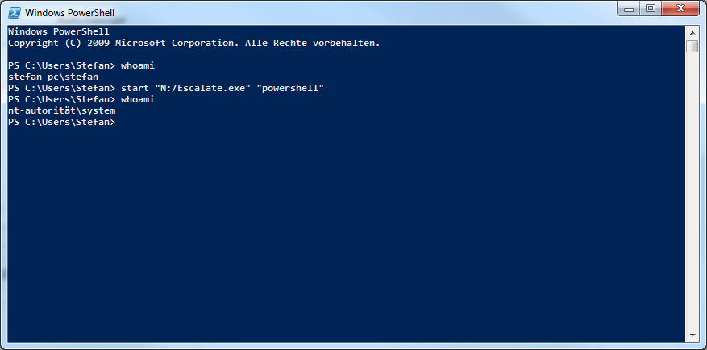

# Windows Privilege Escalation
Proof of concept for process privilege escalation on Windows 7 (SP 1, x64) using the vulnerable driver of the program SpeedFan 4.51. As kernel structures change a lot between versions, this exploit does not work on any other Windows version. It can be updated using [ntdiff](https://ntdiff.github.io/). I do not recommend to run this program if it is outdated, as the best thing that could happen is a program crash, and the likely the second best thing is a bluescreen (I have had tons of them when developing this, the kernel really does not like one messing with its structures).

## How it works
The vulnerable SpeedFan driver offers direct access to the physical memory via [MmMapIoSpace](https://docs.microsoft.com/en-us/windows-hardware/drivers/ddi/wdm/nf-wdm-mmmapiospace) from user mode, since it does not do any range checks when calling its functions. This exploit scans the entire physical memory for EPROCESS structures in memory (owned by the kernel). These structures store critical information about processes, including their privileges. The program then proceeds to steal the authentication token from the System process and overwrites the token of our "target" process.
## Screenshot

